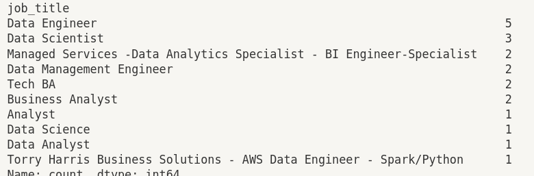
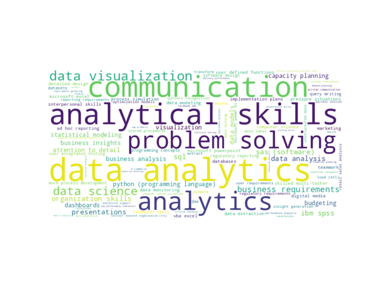
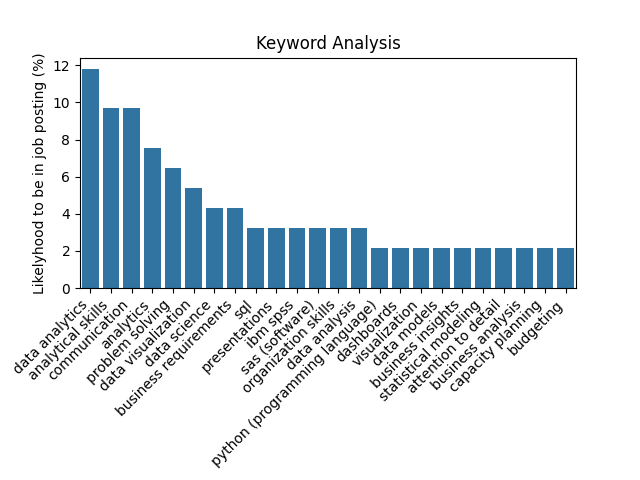

# ds_skills_proj

The GitHub project used as a reference can be found [here](https://github.dev/lukebarousse/Job_Analysis/blob/b9ed4b6109f6439f231a6f1fa9341633b5370f81/LinkedIn.ipynb).

It served as a solid base for my project.

**OBJECTIVE:**

The objective of this project was to analyze the necessary skills for an entry-level job for the keyword search "Data Science" on LinkedIn.

**STEPS:**

1. Scrape data from linkedin.com.
2. Perform analytics on the received data.

**DATA SCRAPING:**

1. Encountered challenges in identifying a proper source for the skills data, which was the primary motivation for this project.
2. If optimized, I would consider parsing company descriptions to extract skills based on relevant keywords, as the skill mentions were too generic.
3. My script has a major flaw: if the page isn't scrolled at least once initially, not all jobs on the page are explored. It's necessary for all jobs to come into view at least once for them to be accessed. However, manually scrolling to the bottom of the page at the beginning allows the script to run correctly.
4. The script is inefficient, resulting in significant data processing efforts, especially for the columns job_time, job_level, and job_type.

**DATA ANALYTICS:**

1. Exported the dataframe to CSV several times to gain a more accurate understanding of the data.
2. Identified that duplicate rows shared common values in the third and fourth columns, and used this as a criterion to remove duplicates.
3. Corrected a significant data scraping issue where data that should have been in three columns ended up in one. Addressed this by analyzing element frequencies and writing a function to handle the split.
4. Found that Data Engineer was the most frequently advertised job.

5. Used filtering functions to focus on entry-level analyst jobs.
6. Generated a word cloud using keywords extracted from the skills data to visually understand the most sought-after skills.

7. Calculated counts and percentages for each skill based on the data (skills), omitting skills with a count of less than 2.
8. Visualized this data in the form of a graph.

**CLOSING COMMENTS:**

1. Acknowledge the need for improvement in the data collection phase.
2. Recognize that the project's outcomes lacked specificity regarding skills.
3. Considered the project a valuable learning experience.
